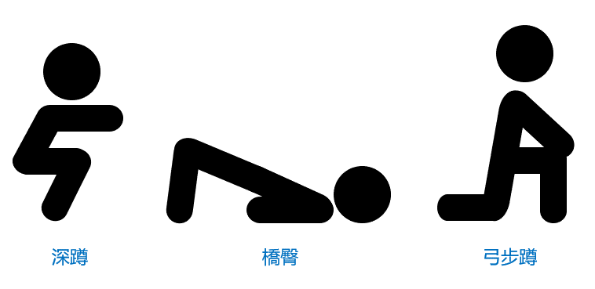
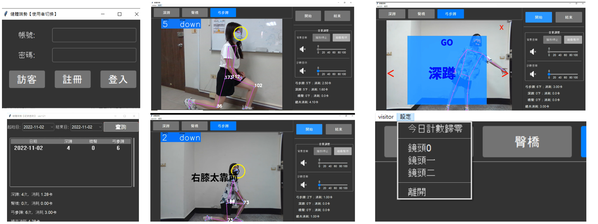
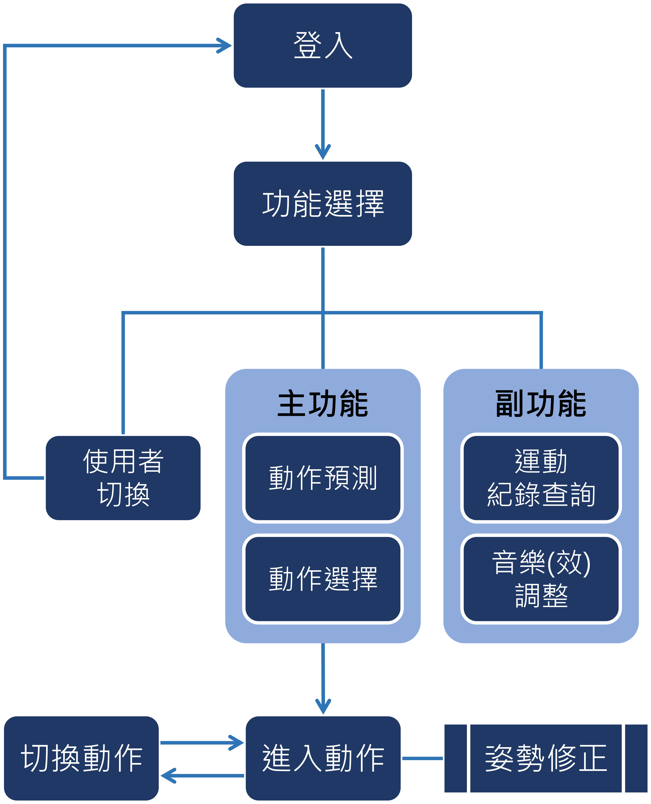
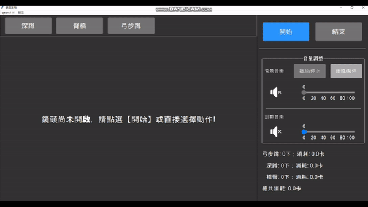
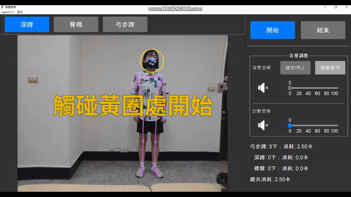
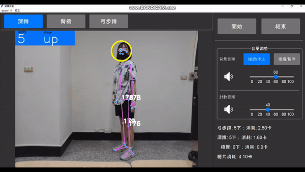
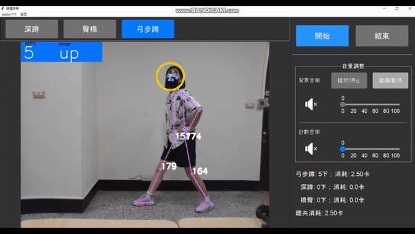
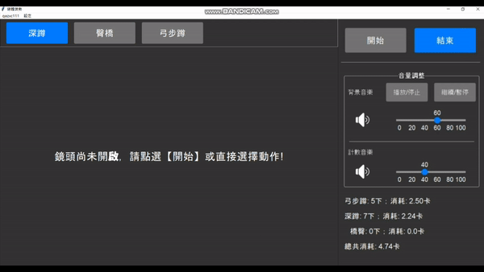
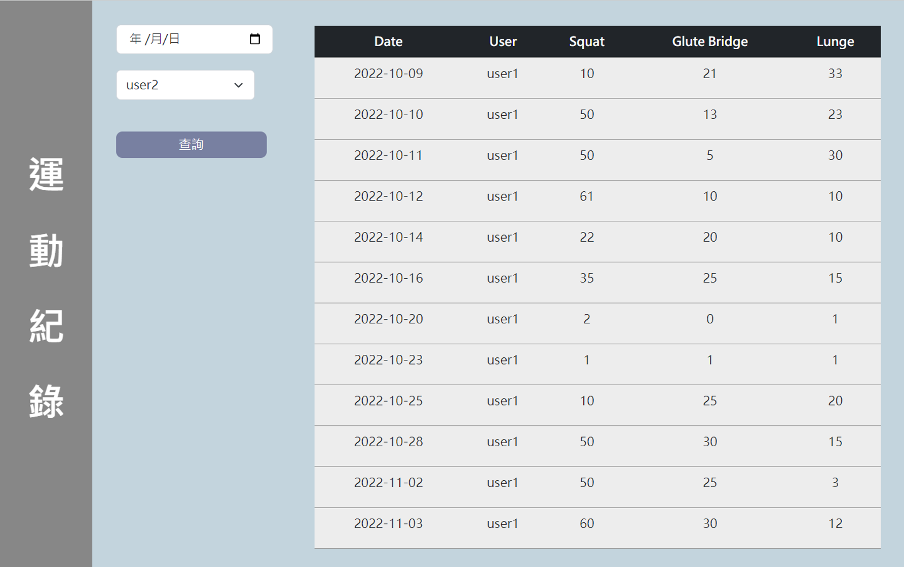

# 專題—健體端勢
【健體端勢】便利實用的居家運動輔助軟體，具運動姿勢預測、 語音提示以修正姿勢、即時熱量消耗、帳號註冊登入、體感介面、歷史紀錄查詢、分析報表等功能。  

 

## 主系統
- **簡介**  
本健身訓練應用程式採用[Google的MediaPipe](https://github.com/google/mediapipe)為核心，使用體感介面以手勢操作系統，若隨時想要暫停或是切換動作只需要做特定姿勢，不需要走到電腦前操控介面就能達成目的，如此增加使用者運動流程的流線化，提高使用者運動的效率。當使用者動作不確實時會提供即時語音回饋，因此使用者可以由反覆的動作糾正逐漸抓到動作的要領。

  
 

- **技術**  
本應用使用CNN、[OpenCV](https://opencv.org/)+MediaPipe的姿勢識別模型[BlazePose](https://google.github.io/mediapipe/solutions/pose.html)。 使用CNN訓練建立三動作模型預測使用者動作，以及透過OpenCV讀取每一幀的影像並使用BlazePose高準度身體姿勢追蹤的機器學習推測出全身的關鍵點。

  
 

- **流程**

  
 

- **實際操作**

 &nbsp;&nbsp;&nbsp;&nbsp;&nbsp;&nbsp;
 &nbsp;&nbsp;&nbsp;&nbsp;&nbsp;&nbsp;
 &nbsp;&nbsp;&nbsp;&nbsp;&nbsp;&nbsp;
 &nbsp;&nbsp;&nbsp;&nbsp;&nbsp;&nbsp;
 &nbsp;&nbsp;&nbsp;&nbsp;&nbsp;&nbsp;
 &nbsp;&nbsp;&nbsp;&nbsp;&nbsp;&nbsp;

 

## 滿版介紹頁面
提供簡易式的滿版介紹頁面，以及游標滑過時顯示更多簡介說明，方便快速了解產品資訊。
[【健體端勢入口】](https://cbf108033.github.io/website/)

  &emsp;&emsp;&emsp;
  

 

## 網頁版紀錄查詢
提供管理者查詢所有使用者運動紀錄，系統框架為[Django](https://www.djangoproject.com/)，使用語言為Python，前端開發工具包含[Bootstrap v5.0](https://getbootstrap.com/docs/5.0/getting-started/introduction/)。

 

## 參考資源
- 介面/主題
  - [【Azure-ttk-theme】](https://github.com/rdbende/Azure-ttk-theme)
  - [【The ttk widget】](https://anzeljg.github.io/rin2/book2/2405/docs/tkinter/ttk-widget-set.html)
- 資料庫建立
  - [【LearnVern-Installing Database in Python】](https://www.learnvern.com/core-python-programming-tutorial-in-hindi/installing-database-in-python)  

